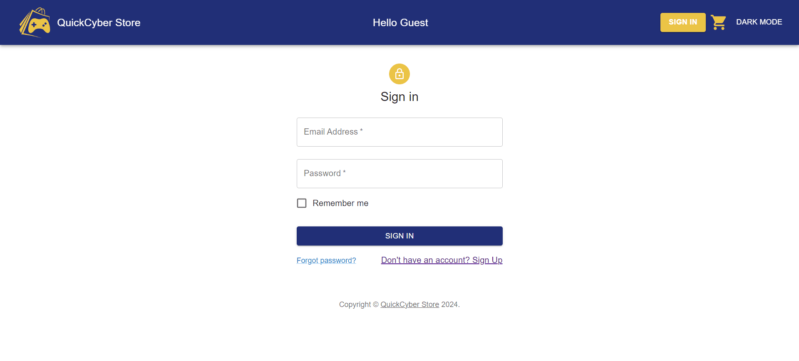
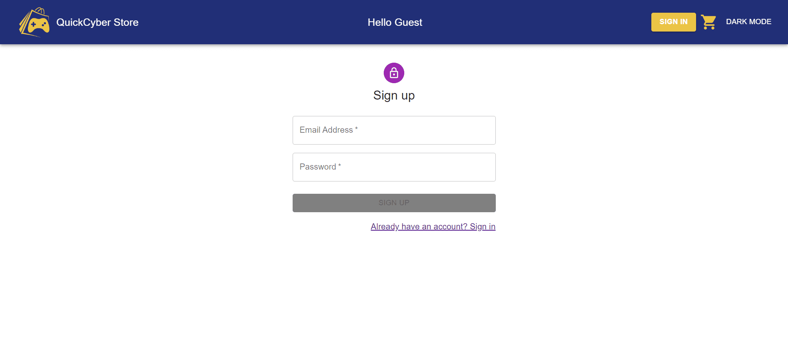

# QuickCyber Store

QuickCyber Store es una aplicación de comercio electrónico basada en la web construida con React y Material-UI. Te permite navegar y comprar productos electrónicos de alta calidad.

## Características

- Una amplia selección de productos electrónicos.
- Un carrito de compras para agregar y gestionar los productos seleccionados.
- Una página de pago segura para completar tus compras.
- Interfaz de usuario elegante y fácil de usar.
- Productos de alta calidad a precios competitivos.

## Cómo ejecutar la aplicación

1. Clona el repositorio en tu máquina local:

   ```sh
   git clone https://github.com/marcosd59/quick-cyber-store
   ```

2. Navega al directorio del proyecto:

   ```sh
   cd quick-cyber-store
   ```

3. Instala las dependencias necesarias:

   ```sh
   npm install
   ```

4. Inicia la aplicación:

   ```sh
   npm start
   ```

Asegúrate de tener instaladas las siguientes dependencias:

```json
"@babel/plugin-proposal-private-property-in-object": "^7.21.11",
"@emotion/react": "^11.11.3",
"@emotion/styled": "^11.11.0",
"@mui/icons-material": "^5.15.7",
"@mui/joy": "^5.0.0-beta.25",
"@mui/material": "^5.15.7",
"@mui/styled-engine-sc": "^6.0.0-alpha.14",
"@stripe/react-stripe-js": "^2.7.0",
"@stripe/stripe-js": "^3.3.0",
"@testing-library/jest-dom": "^5.17.0",
"@testing-library/react": "^13.4.0",
"@testing-library/user-event": "^13.5.0",
"@vendia/serverless-express": "^4.12.6",
"accounting": "^0.4.1",
"axios": "^1.6.8",
"cors": "^2.8.5",
"dotenv": "^16.4.5",
"express": "^4.19.2",
"firebase": "^10.8.0",
"react": "^18.2.0",
"react-dom": "^18.2.0",
"react-hook-form": "^7.51.3",
"react-router-dom": "^6.22.0",
"react-scripts": "5.0.1",
"react-uuid": "^2.0.0",
"serverless-http": "^3.2.0",
"stripe": "^15.4.0",
"styled-components": "^6.1.8",
"web-vitals": "^2.1.4"
```

## Capturas de pantalla

### Página principal


### Carrito de compras


### Login



### Register



### Datos de envio


### Datos de pago


### Modo oscuro


## Clonar este repositorio

```bash
https://github.com/marcosd59/quick-cyber-store
```

## Tecnologías

- [React](https://reactjs.org/)
- [MUI Core v5](https://mui.com/)
- [Netlify](https://www.netlify.com/)

## Cómo contribuir

Si tienes una sugerencia para mejorar este proyecto, por favor haz un fork del repositorio y crea una pull request. También puedes simplemente abrir un issue con la etiqueta "enhancement".
¡No olvides dar una estrella al proyecto si te ha ayudado!

Las contribuciones son lo que hacen a la comunidad de código abierto un lugar increíble para aprender, inspirar y crear. Cualquier contribución que hagas será **enormemente apreciada**.

1. Haz un Fork del proyecto
2. Crea tu rama de característica (`git checkout -b feature/AmazingFeature`)
3. Haz commit de tus cambios (`git commit -m 'Add some AmazingFeature'`)
4. Haz push a la rama (`git push origin feature/AmazingFeature`)
5. Abre una Pull Request

## Integrantes

[Marcos Damián Pool Canul](https://github.com/marcosd59)

[Alexis Rodriguez Ramon](https://github.com/Al3xR)

## Documentación

[QuickCyber Store](./Documentación.pdf)
